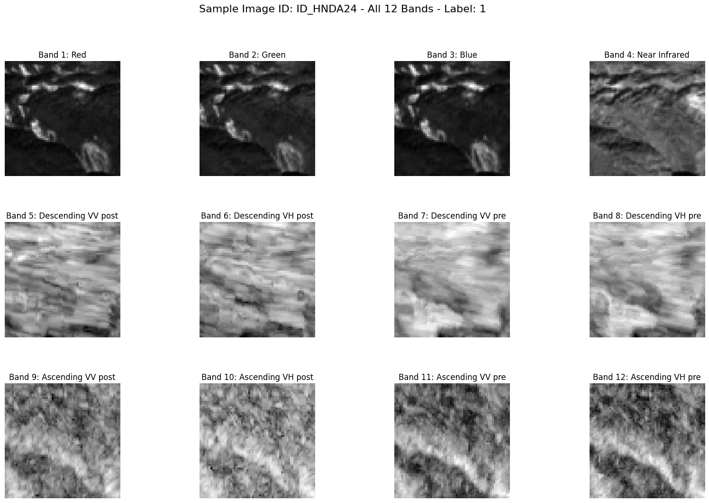
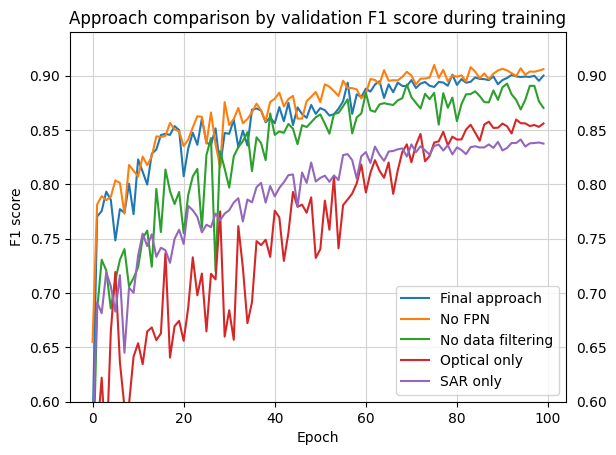

# 🛰️ Landslide Image Classification from Multi-Modal Satellite Imagery
Tackling Zindi's [Landslide Classification Challenge](https://zindi.africa/competitions/classification-for-landslide-detection)— a computer vision task on bi-temporal Sentinel-1 (SAR) and Sentinel-2 (optical) satellite imagery.
This project implements classic data preprocessing, augmentation, and deep learning using a lightweight multi-modal architecture (< 1M parameters).
An efficient data filtering method has proven to not only shrink training costs by more than half (279 → 126 Wh) but also significantly boost performance.
Another architectural choice, the Feature Pyramid Network (FPN), did not increase performance.

The solution achieved a test F1-score of 0.877 (winning F1: 0.907) and ranked 23rd out of 303 teams on the final leaderboard.

## 📊 Data Overview
The provided dataset combines bi-temporal Sentinel-1 (SAR) and Sentinel-2 (optical) satellite imagery.
The SAR data from Sentinel-1 provides VH and VV bands for both pre- and post-disaster imagery, as well as for descending and ascending passes, enabling the training of a *change detection network*.



The training dataset is highly unbalanced (~17% positives) and contains even images of waters and other obvious non-landslide images. This observation motivated the application of a pre-filter model that would catch obvious negatives to exclude them from the deep learning training.   

## 🏗️ Model Pipeline and Architecture
This solution addresses the challenge by leveraging both optical and radar data in the same model to overcome limitations like cloud coverage. The approach combines:

- Multi-modal data fusion: Integrating optical (Sentinel-2) and SAR (Sentinel-1) imagery
- Two-stage detection: XGBoost pre-filter + Deep CNN for efficiency
- Temporal analysis: Using pre- and post-event imagery to detect changes
- Advanced architecture: Custom Multi-Modal FPN with separate branches for different data modalities

### Stage 1 - Negative Filter (XGBoost)

- Extracts hand-crafted features (NDVI, SAVI, polarization ratios, etc.)
- Filters out obvious non-landslide areas with 100% precision (dont loose any positive datapoint)


### Stage 2 - Multi-Modal FPN

- Separate CNN branches for optical and SAR data
- Feature Pyramid Network for multi-scale feature extraction
- Ensemble of 10 models from cross-validation

### Inference Stage
Predicting the test data is supported by the following concepts the boost performance and robustness:

- 10-fold cross-validation ensuring generalization
- Test-time augmentation with 8 transformation combinations (h_flip x v_flip x rotation_90°)
- F1-optimized thresholds for each model


## 📈 Performance

The figure below shows the behavior of the validation F1-score during training for different approaches.
The curves represent the mean values over 10 folds. The blue curve represents the final approach submitted to the challenge.
All other curves are produced by removing a single building block from the final approach, allowing a direct comparison of the importance of each concept.
However, since all approaches use the same hyperparameters, it is possible that individual models could perform better with dedicated hyperparameter tuning.



### Feature Pyramid Network
The FPN architecture enables the model to simultanously detect large- and small-scale patters. In a direct comparison with a conventional CNN there is no difference in performance. This result suggests that the scale of the images is not large enough that a advances architecture such as the FPN, could lead to any advantage. 

### Data Filtering
Cleaning the dataset from *obvious negatives* enabled the model to focus on vavluable examples of landslide and non-landslide images, what boostes performance by a noticable amount. This methode enables a much faaster and more balanced training (~39% positives vs ~17% pre-filtering) 

### Multi Modality
The *SAR only* and *optical only* curves fall significantly under the blue one, indicating that multi-modality plays a key roll for landslide detection. While the SAR model trains converges faster the optical counterpart performed better after completion of 100 training epochs.


## 🚀 Quick Start

### Installation

Clone the repository
```
git clone https://github.com/PhilipJanz/Landslide-Image-Classification.git
cd Landslide-Image-Classification
```

Install dependencies
```
pip install -r requirements.txt
```

### Data Preparation

Place raw satellite images in data/raw/train/images/ and data/raw/test/images/
Run data & feature preprocessing:
```
bashpython src/utils/image_preprocessing.py
```

### Training

> [!NOTE]
> Check out the config.py file to set crucial parameters and model name.

Train the negative filter model
```
python src/model/neg_filter_model.py
```

Train the main CNN model
```
python src/model/train.py
```

Optional: Hyperparameter optimization
```
python src/model/hyperparameter_opt.py
```

### Prediction
```
bashpython src/model/predict.py
```


## 🌍 Environmental Impact
To align with the challenge's ethical guidelines, this project includes carbon emission tracking using CodeCarbon to monitor the environmental footprint of model training.
The final approach, involving the training of 10 distinct deep learning models, consumed around 126 Wh on a system with an Intel i7-9700K CPU and an NVIDIA RTX 2080Ti.
This solution is therefore extremely lightweight and scalable, even on less powerful consumer hardware.
